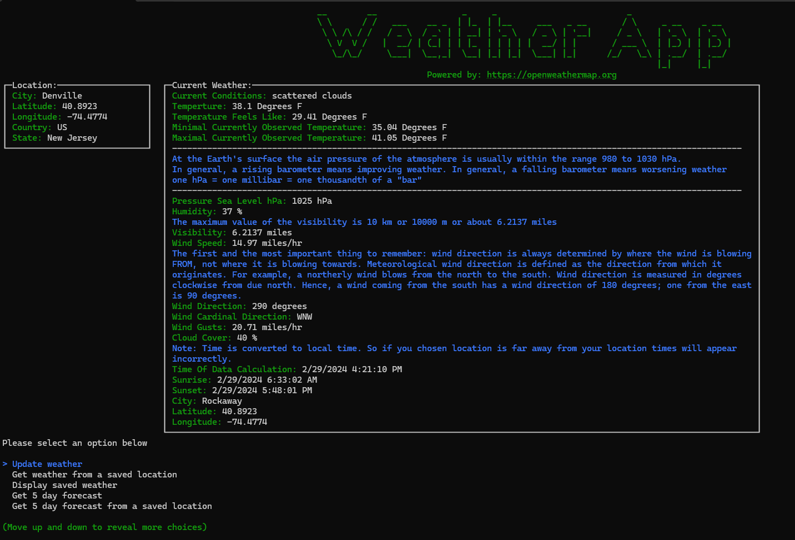

# Open Weather Map Console Application with SQLite

## Powered by [OpenWeatherMap.org](https://openweathermap.org/)
## Uses [Spectre Console](https://github.com/spectreconsole/spectre.console) for the display
## Uses [Coordinat Sharp](https://coordinatesharp.com/) for the celestial data calculations

## App screen shot

## Directions for use

1. Clone app
2. Rename APIKEY-Copy.xml to AIPKEY.xml
3. Get your api key from [OpenWeatherMap.org](https://openweathermap.org/)
3. Build or publish the app in Visual Studio
4. Run the exe and enjoy -- it will ask for your api key and default location
5. Or for Ubuntu run this command in terminal --> dotnet publish -c release -r ubuntu.22.04-x64 --self-contained
6. Running on Windows 11 -- go to System -> For Developers -> Terminal and set to Windows Console Host (this allows the app to resize the console to the correct width and height)

## About
This is a simple app that displays current weather and 5 day 3hr forecast from Open Weather API.
By default the app also updates the weather for the default location hourly -- this feature can be stopped with an option in the extended menu.
Basic weather statistics and celestial data will also be displayed incrementally.
Both the hourly weather update and the statistics/celestial data features make use of C#'s multithreading capabilities to run tasks on recurring inervals.

The three api Open Weather endpoints in use are 

1. Current weather endpoint https://api.openweathermap.org/data/2.5/weather?lat={lat}&lon={lon}&appid={APIkey}
2. 5 day forecast endpoint https://api.openweathermap.org/data/2.5/forecast?lat={lat}&lon={lon}&units=imperial&appid={APIkey}
3. Location endpoint http://api.openweathermap.org/geo/1.0/direct?q={cityName},{stateCode},{countryCode}&limit={limit}&appid={APIkey}

The app will save your locations in a SQLite database and your api key in APIKEY.xml
By default, on start up, the app will update the weather for the default location hourly and automatically save the current weather for that default location to the database.
Weather statistics and celestial data for the default location will also be displayed every 14 minutes  -- this data is not saved to database. 
This statistics feature needs at least two weather data points in the database and will just diplay "Not enough weather data points to display an average" while the data is being collected.
The default location is always the first one entered when the app starts and is changeable.
Multiple locations can be added. 

Locations outside the US can be selected just follow the directions in the app.
Note: You may have to experiment a bit to get the correct location. Sometimes city names are not found.
For example, for some reason, the api wouldn't find Parker CO so I used Centennial CO -- a town or two north. 

Use [ISO 3166 country codes](https://en.wikipedia.org/wiki/List_of_ISO_3166_country_codes) and if in the US don't put periods or spaces between 
state abbreviations. For example Use NJ not N.J. Or for country use US not U.S. 

## Motivation for building this app

* To continue learing software development and engineering. Some core concepts demonstrated are:
	* Multithreading with C# -- an intersting problem was displaying and saving the updated weather hourly and then also showing statistics/celestial data every 14 minutes (see ThreadDisplayCalculations.xlsx for solution)
	* Asynchronous programming and consuming data from an API
	* Basic SQL operations with C#
	* Writing clean documented code
* In addition to the educatational benifits I also just enjoy building pratical and useful applications
* A fast and efficient way to get weather and forecast data without all the FULL PAGE ADVERTISEMENTS one encounters on many of the leading websites.
* Build a weather database for my local area to view historical weather
* Make use of a Rasbperry Pi PC I had collecting dust

## Data saved in text files
After each api call made to the current weather endpoint (options "Update weather" and "Get weather from a saved location") 
the location and current weather will be saved in SavedCurrentLocation.txt and SavedCurrentWeather.txt -- data is overwritten each time

This is to save the application state so api calls can be limited. The option "Display saved weather" pulls the data from the text files not SQL

After each api call made to the forecast endpoint (options "Get 5 day forecast" and "Get 5 day forecast from a saved location") 
the location and 5 day forcast will be saved in SavedForecastLocation.txt and SavedForecast.txt -- data is overwritten each time

This is to save the application state so api calls can be limited. The option "Display saved forecast" pulls the data from the text files not SQL

## Data saved to SQL
Each location entered is saved to the database and is the parent table of weather data points

By default, on start up, the app will update the weather for the default location hourly and automatically save the current weather for that default location to the database.

Weather statistics for the default location will also be displayed every 14 minutes. 

This feature needs at least two weather data points in the database and will just diplay "Not enough weather data points to display an average" while the data is being collected.

After each api call made to the current weather endpoint (options "Update weather" and "Get weather from a saved location") the current weather for that location will be saved in the database.

Note: If you delete a location ALL saved SQL weather points will be deleted with it.

No forcast data is saved to SQL

Overall the app is easy to use and a fast way to check the weather and forecast by you.

## Statistics

The current time interval (14 minute) recurring weather statistics are.

* 8 hour average temperature, pressure, humidity, and wind speed.
* 8 hour max/min temperature, pressure, humidity, and wind speed.
* 8 hour rain/snow totals.

The extended menu displays options for 8 hour, 12 hour, and 24 hour statistics.

## Celestial Data

The Celestial data displayed include.

* Solar: sunrise, sunset, solar noon, civil dawn, civil dusk, hours of day, and hours of night
* Lunar: moonrise, moonset, moon phase, moon fraction, moon distance from Earth
* Last and next solar eclipse data
* Last and next lunar eclipse data
* Lunar perigee and apogee data
* Equinox and solistice dates

## Raspberry Pi build
In Visual Studio Publish there is a 32 and 64 bit linux arm build that is set up for the Raspberry Pi.
The Pi 3 is a 64 bit machine but the standard OS is 32 bit so in that case use the 32 bit build option.
Running this on a single board PC is the best bet for building up a weather database.
There is also a standard linux x64 build that can be used for Ubuntu ect.

## Plans

Add an "On this day last year" feature that will display the average temperature and weather conditions for this day last year.
Could also add "On this day last month"

Add settings options to let the user
* Prevent the app from aking to display saved weather everytime and just automatically update on start
* Suppress or show the header
* Prevent the recurring update from starting
* Display short or long menu by default

Add the air polution end point https://openweathermap.org/api/air-pollution 

Make an actual user interface maybe with [Terminal.Gui](https://github.com/gui-cs/Terminal.Gui), [.NET MAUI](https://learn.microsoft.com/en-us/dotnet/maui/what-is-maui?view=net-maui-8.0) or both.

Once user mobile MAUI interface is constructed include weather maps end point https://openweathermap.org/api/weathermaps 
